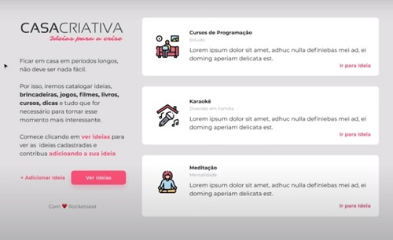

<h1 align="center">
  

</h1>

<p align="center">:house_with_garden: Fique em casa.</p>

<p align="center">
  <a href="#rocket-tecnologias">Tecnologias</a>&nbsp;&nbsp;&nbsp;|&nbsp;&nbsp;&nbsp;
  <a href="#wrench-instalação-e-uso">Instalação e uso</a>&nbsp;&nbsp;&nbsp;|&nbsp;&nbsp;&nbsp;
  <a href="#memo-licença">Licença</a>
</p>

<br>

<div align="center">
  
  
</div>

<br>

## :rocket: Tecnologias

As seguintes tecnologias foram utilizadas no desenvolvimento do projeto:

- [HTML](https://devdocs.io/html/)
- [CSS](https://devdocs.io/css/)
- [Javascript](https://devdocs.io/javascript/)
- [Node.JS](https://nodejs.org/en/)
- [SQLite3](https://www.sqlite.org/index.html)

<br>

## :computer: Projeto
Casa Criativa é uma aplicação web, que cadastra e exibe ideias de atividades para fazer em casa durante o período de isolamento social.

<div align="center">
  
</div>

<br>

## :wrench: Instalação e uso

Para rodar a aplicação, você precisa ter o [Node](https://nodejs.org/en/) instalado em sua máquina e seguir os passos abaixo:

1) Abra um terminal e copie este repositório com o comando
    ```
    git clone https://github.com/GabrielNR/Casa-Criativa
    ```
    ou use a opção de download.

2) Entre na pasta com
    ```
    cd Casa-Criativa
    ```

3) Instale as dependências
    ```
    npm install
    ```

4) Rode a aplicação:
    ```
    npm start
    ```

5) Acesse ```http://localhost:3000``` no seu navagador.

<br>

## :memo: Licença

Esse projeto está sob a licença MIT. Veja o arquivo [LICENSE](/LICENSE) para mais detalhes.
